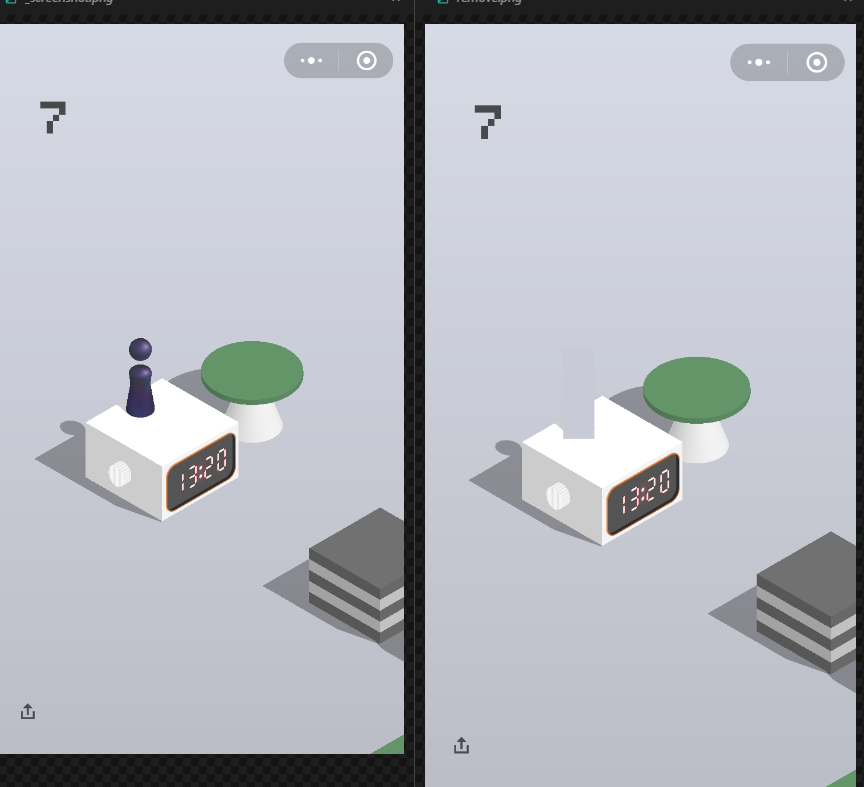
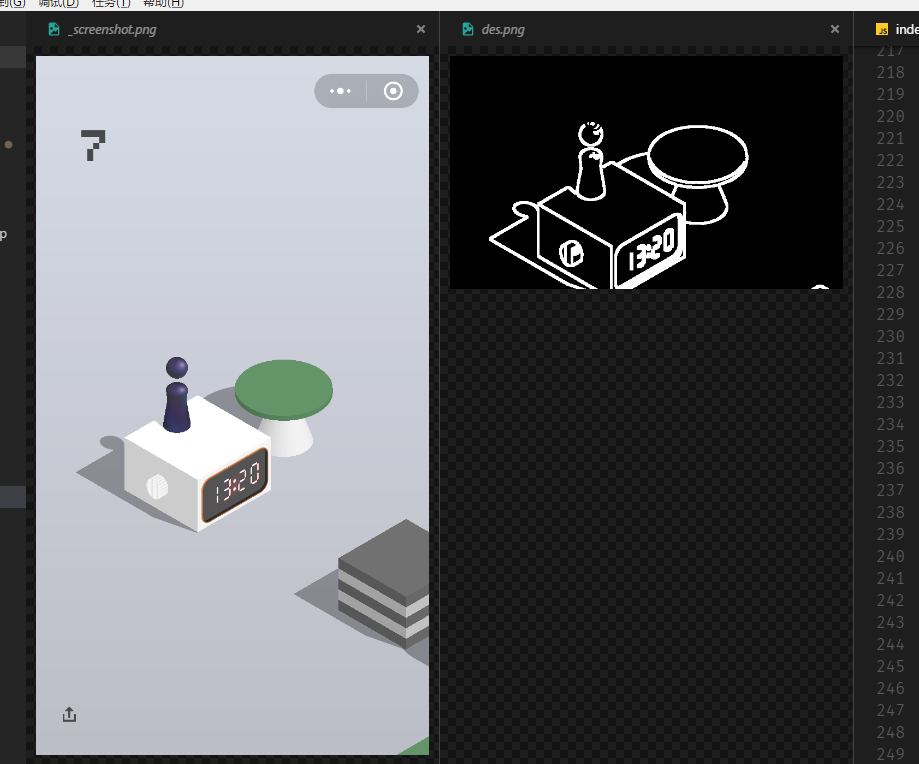

# 微信跳一跳 (nodejs)

使用 [node-opencv](https://github.com/peterbraden/node-opencv) 来实现 opencv 的调用。

## 小人坐标获取

由于小人的颜色是固定的，根据截图中，设置一个 RGB 的阈值，判断小人的底部的颜色。
从上到下，一行一行扫描，符合阈值的最后一行，即为小人的底部。

找到小人后，大概估算出小人的宽度和高度，用背景颜色将小人覆盖掉。

## 目标点坐标获取

由于目标块总是出现在屏幕的 三分之一 到 三分之二 处，首先截取中间的 三分之一，缩小范围。

使用 opencv 的边缘检测(canny), 生成的二值化的图片，白色为边缘。
如图:

从上往下，一行一行扫描，找到第一个边缘点(白色点)，即为目标块的顶点。

但是有可能出现小人的头顶超过目标块，出现判定错误。

因此在上面一步，移除了小人，所以不会被小人的头顶影响。

从顶点开始，顺着往右下的方向扫描，直到一个像素的右边和右下角都为非边缘点(黑色)，此时视为到达了目标块的最右点。

根据顶点和最右点，可以判定出目标块的中心。

## 跳一跳

获取到起始点和目标点的坐标后，直接计算欧氏距离，调整距离和按压时间的线性关系，跳一跳。